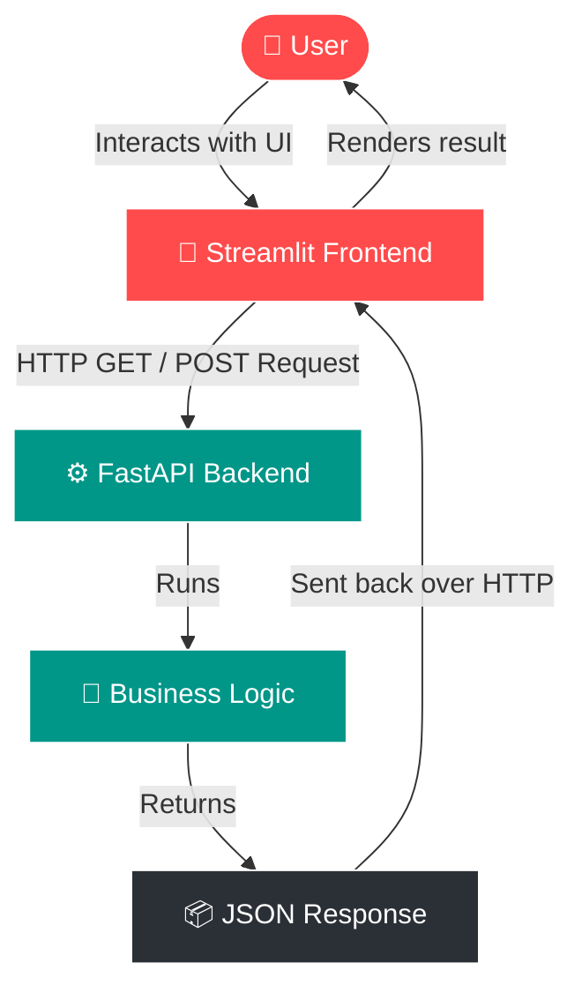
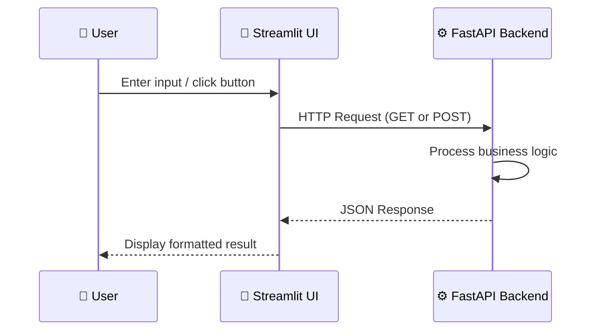
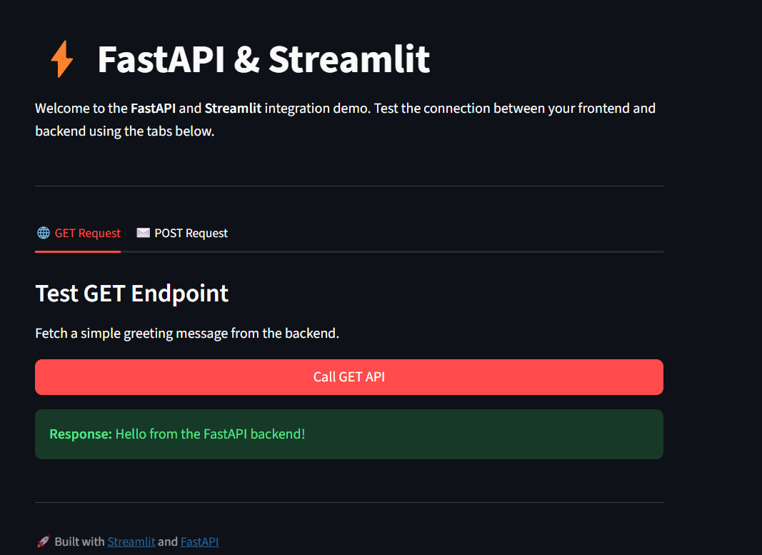
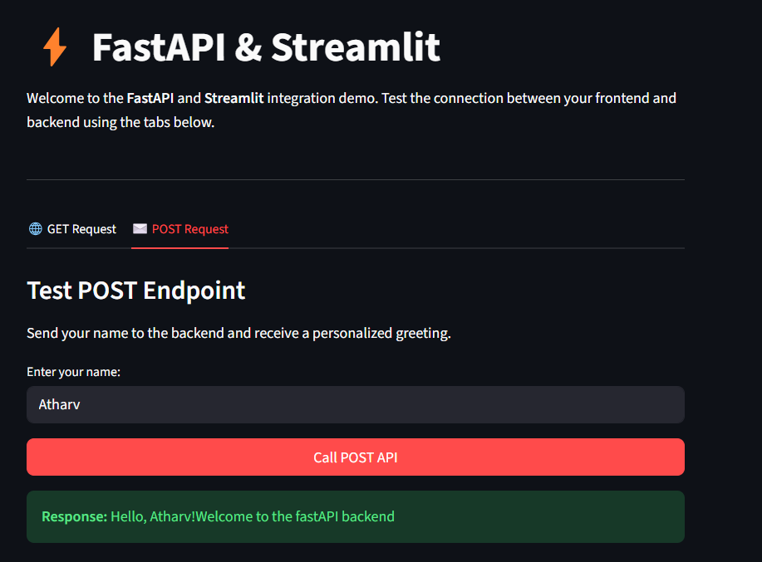

<div align="center">

# ⚡ FastAPI & Streamlit Demo

### A minimal full-stack Python app showing GET & POST communication between a Streamlit frontend and a FastAPI backend

[](https://www.python.org/)
[](https://fastapi.tiangolo.com/)
[](https://streamlit.io/)
[](#license)

</div>

---

## 📖 Overview

This project is a **simple full-stack Python application** built to demonstrate how a frontend and backend communicate with each other over HTTP.

- 🎨 **Frontend** — built with [Streamlit](https://streamlit.io/)
- ⚙️ **Backend** — built with [FastAPI](https://fastapi.tiangolo.com/)
- 🔗 **Communication** — plain HTTP requests, JSON in / JSON out

The goal is to keep the frontend and backend **fully decoupled**, so each can be run, tested, and demoed independently.

---

## 🏗️ Architecture



### Request lifecycle



---

## 🎯 Objective

Demonstrate how a **frontend and backend communicate with each other** in a full-stack Python application, split into two independent components:

### 1️⃣ Frontend — Streamlit
- Simple, interactive user interface
- Accepts user input
- Sends HTTP requests to the FastAPI backend
- Receives and displays the JSON response

### 2️⃣ Backend — FastAPI
- REST API endpoints
- Accepts requests from the Streamlit frontend
- Implements business logic
- Returns results as JSON

---

## 📂 Project Structure

```text
fastapi-streamlit-demo-GET-POST/
│
├── backend/
│   ├── __init__.py
│   └── main.py            # FastAPI app — /hello (GET) & /greet (POST)
│
├── frontend/
│   └── app.py              # Streamlit UI — calls the backend
│
├── requirements.txt
├── pyproject.toml
└── README.md
```

---

## 🚀 Getting Started

### 1. Clone the repository

```bash
git clone https://github.com/atharvwagh23/fastapi-streamlit-demo-GET-POST.git
cd fastapi-streamlit-demo-GET-POST
```

### 2. Install dependencies

```bash
pip install -r requirements.txt
```

### 3. Run the FastAPI backend

> ⚠️ Run this from the **project root** (the folder containing `backend/` and `frontend/`), so Python can resolve the `backend` package correctly.

```bash
uvicorn backend.main:app --reload
```

The API will be available at `http://127.0.0.1:8000`, with interactive docs at `http://127.0.0.1:8000/docs`.

### 4. Run the Streamlit frontend

In a **separate terminal** (also from the project root):

```bash
streamlit run frontend/app.py
```

The UI will open at `http://localhost:8501`.

> ℹ️ The frontend is hardcoded to call the backend at `http://127.0.0.1:8000`. If you change the backend's host/port, update `BACKEND_URL` in `frontend/app.py` to match.

---

## 🖥️ Output

### 🔵 GET Request

Calls `/hello` on the backend and displays the greeting message returned.



### 🟢 POST Request

Sends a name to `/greet` on the backend and displays the personalized greeting returned.



---

## ✅ Requirements Demonstrated

| Requirement | Status |
|---|---|
| Separate frontend and backend | ✅ |
| Communication via HTTP | ✅ |
| REST API with FastAPI | ✅ |
| UI with Streamlit | ✅ |
| JSON request/response handling | ✅ |
| Business logic separated from UI | ✅ |

---

## 🧪 Testing Independently

- **Backend** — test directly via the auto-generated Swagger docs at `/docs`, or with any API client (Postman, curl, HTTPie).
- **Frontend** — runs on its own and simply points to the backend's base URL, so it can be swapped or reconfigured freely.

---

## 🛠️ Tech Stack

| Layer | Technology |
|---|---|
| Frontend | Streamlit |
| Backend | FastAPI |
| Server | Uvicorn |
| Language | Python 3.10+ |

---

<div align="center">

🚀 Built with **Streamlit** and **FastAPI**

</div>
